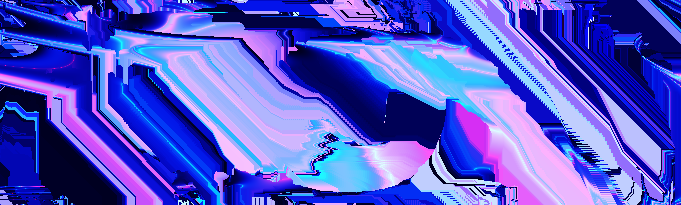

# First Contact (2023)

**An interactive installation questioning our interpretation of exotic consciousness and introducing the concept of _delphic AI_.**

_Machine learning, shader art, generative art, real-time art, interactive installation_

---

First contact with alien civilizations, conversation with artificial intelligences, abstract art contemplation: these are all forms of esoteric communication with an entity supposedly conscious, which interacts with intent. But what if the impression of consciousness and intent doesn't emerge from the entity we're communicating with, but rather from within ourselves?

On August 6, 1967, astrophysicist Jocelyn Bell Burnell picked up a radio signal that science couldn't yet explain. The code name for the signal was LGM-1, standing for "little green men 1", because even for some top scientists, only intelligent extraterrestrial life could explain the phenomenon. It seems as if we can't help but believe that there must always be something conscious behind unexplained signals, whether they come from a distant star, a machine, or the depths of the ocean. That is based on this observation that _First Contact_ makes sense.

_First Contact_ is an installation where a stream of abstract visuals appears on a screen in front of the spectator, whose facial expression and hand gestures are being detected and fed into a program that makes the video evolve in real time; for example, when the spectator is first perceived, the visuals "awaken", but most interactions are less direct and based on whole entire sequences of movements, thereby creating some kind of _exotic conversation_ between the spectator and the machine.

_First Contact_ does not take the path of _imitative AIs_ like ChatGPT or Blade Runner's Android, but rather something that could be called _delphic AI_.

Delphi is an ancient sacred Greek city and seat of the Pythia, an oracle that expressed herself in enigmatic riddles that where then translated by priests into actionable assertions. This is a prime example of superior knowledge authority being derived from the setting rather than the content: the Oracle of Delphi was consulted by the greatest kings, but stripped from the temple and the respect that she benefited from, her utterrances were mere gibberish to the common ear.

The goal is not to decipher and talk the language, but rather to feel the complexity of the language itself and derive from it an illusion of sentience.

In this regard, the Oracle of Delphi, LGM-1, and _First Contact_, are one and the same - a manifestation of _delphic AI_: unexplained yet complex communication give the illusion of sentience.

---

The code behind _First Contact_ as well as the installation instructions are [open sourced on github](https://github.com/ninofiliu/first-contact).

_First Contact_ was first put on display at [36 Degrés](https://www.36degres.art/) and [Galerie Charlot](https://www.galeriecharlot.com/)'s [Psych.é exhibition](https://www.36degres.art/psych-e), featuring other artists at the intersection of art and technology like [Jan Kounen](https://en.wikipedia.org/wiki/Jan_Kounen).

This exhibition concluded by a live performance of the artist reusing bits and pieces of the visual alogorithm behind _First Contact_ displayed as projection mapping along with a modular synthesizer live from [Accalmie](https://www.instagram.com/accalmiemusic/).

Also exhibited at [Me & Who?](https://www.instagram.com/p/DFXjW0tNOE1/), a group show by [Distraction Collective](https://distraction.fun/)
